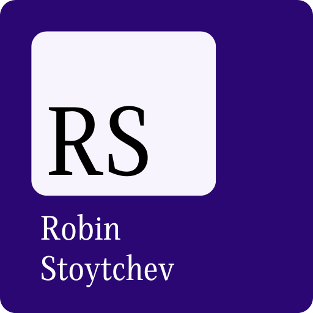

Robin Stoytchev's Portfolio
Welcome! 

This repository contains the source code for my personal portfolio website, built using vanilla HTML, CSS, and JavaScript. It’s a fun, clean, and responsive showcase of my web development skills and projects. Check out the live site here: https://robinstoytchev.netlify.app/

About This Project
This portfolio is designed to highlight my journey as a web developer, featuring sections for my bio, skills, projects, and contact information. It’s a static website with no backend, making it lightweight and easy to maintain.
Tech Stack: HTML5, CSS3, JavaScript (ES6+)

Hosted On: Netlify

Purpose: A personal portfolio to showcase my work and connect with potential collaborators or employers.

Features
Responsive design that works on desktops, tablets, and mobile devices.

Smooth animations and transitions for an engaging user experience.
Clean, minimalistic layout with a focus on readability and aesthetics.
Easy-to-navigate sections for my bio, skills, projects, and contact details.

Getting Started
Want to explore or use this code? Here’s how to get started:
Clone the Repository  
bash

git clone https://github.com/RobinStoytchev/robin-stoytchev-portfolio.git

Open the Files
Open the index.html file in your web browser or a local development environment (like VS Code) to view the portfolio.

Customize It
Feel free to fork this repository and modify the HTML, CSS, or JavaScript to suit your needs!

Note: This is a static site, so no server or build tools are required—just open the HTML file or host it on a service like Netlify or GitHub Pages.

How to Contribute
While this is a personal portfolio, I welcome feedback or suggestions! If you’d like to contribute:
Fork this repository.

Create a new branch for your changes:  
bash

git checkout -b feature/your-feature-name

Make your changes and commit them:  
bash

git commit -m "Add your descriptive message"

Push to your fork and submit a pull request.

Please keep contributions aligned with the project’s goal of maintaining a simple, clean portfolio.

## Screenshots

